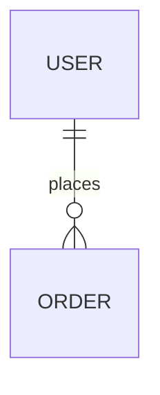

# Database Plan — `<project>`

## Decision

- **Primary database:**
- **ORM/query layer:**
- **Hosting/region:**
- **Why:**
- **Assumptions:**

## Diagram

## Models

| Model | Purpose | Key data | Relationships and invariants |
| --- | --- | --- | --- |

## Indexes

| Model | Index | Query or invariant | Phase |
| --- | --- | --- | --- |

## MVP and scale

| Do now | Later trigger | Later action |
| --- | --- | --- |

## Redis

- **Decision:** Not needed / recommended
- **Workloads:**
- **Keys, TTL, and invalidation:**
- **Provider and reason:**

## Risks and open decisions

-

Keep current and proposed structures clearly labelled. Include only fields that explain relationships, integrity, access patterns, or important type decisions.
